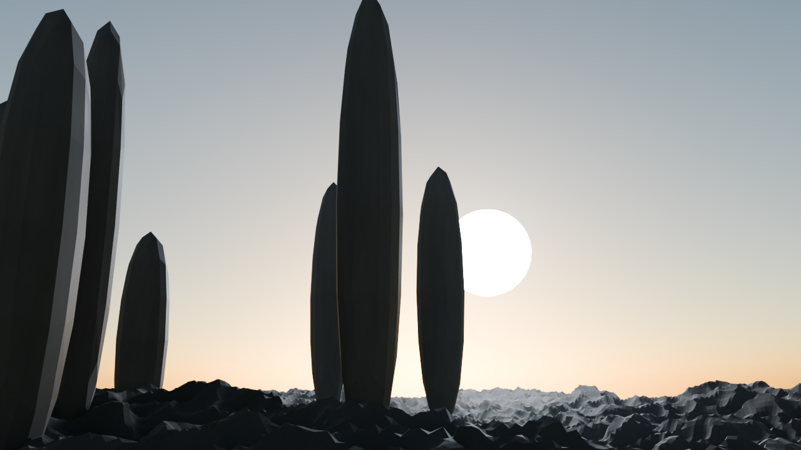
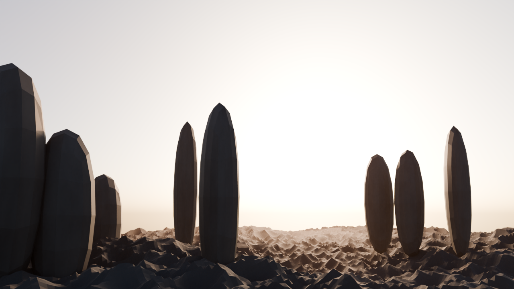
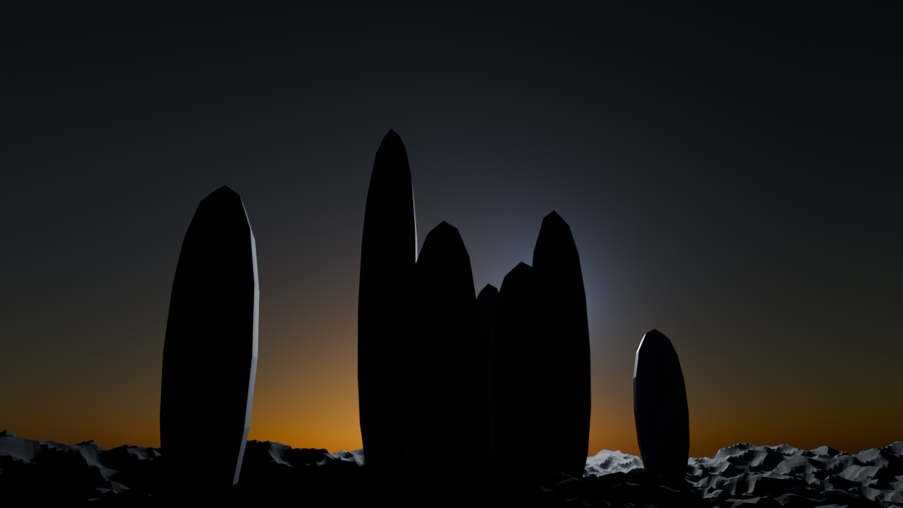
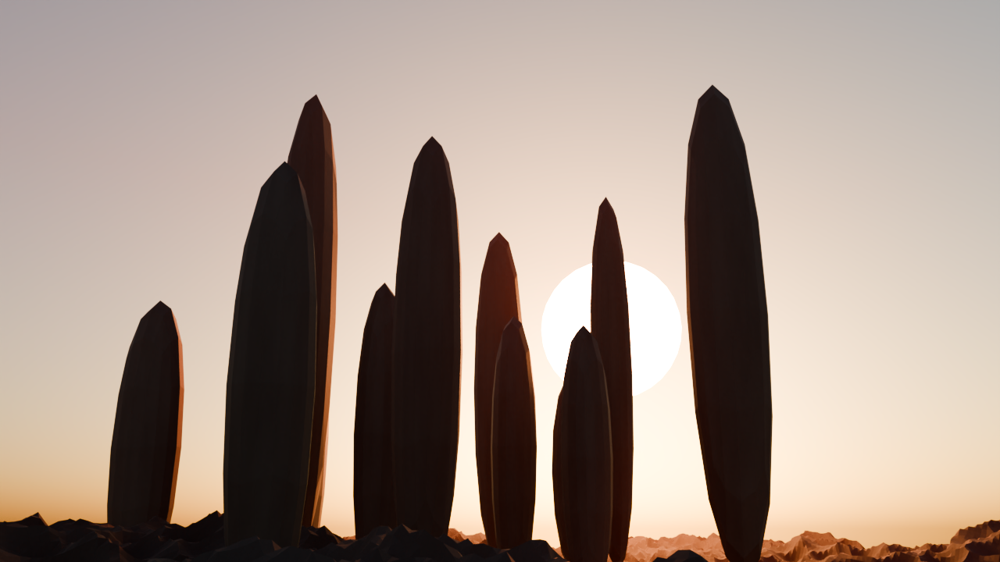
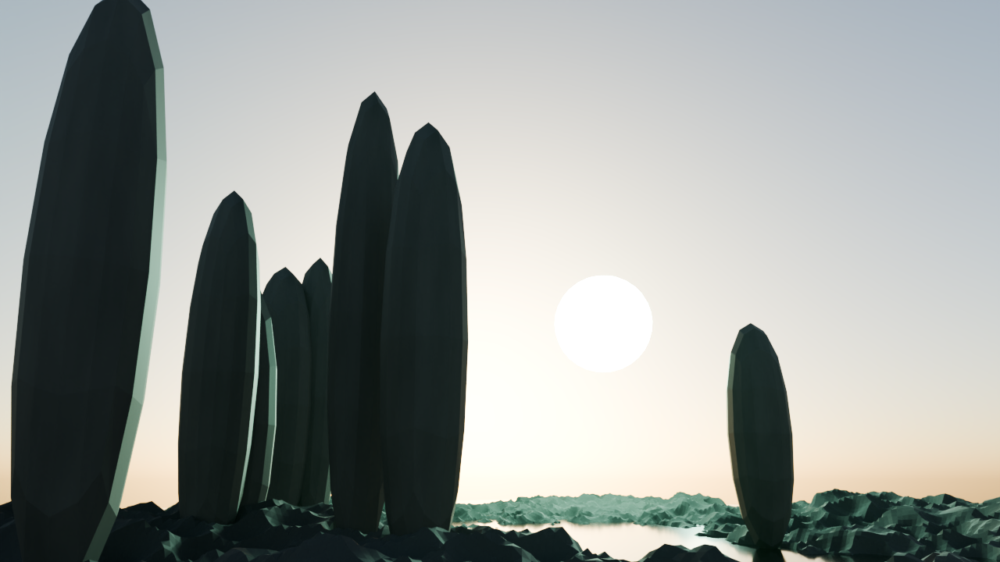
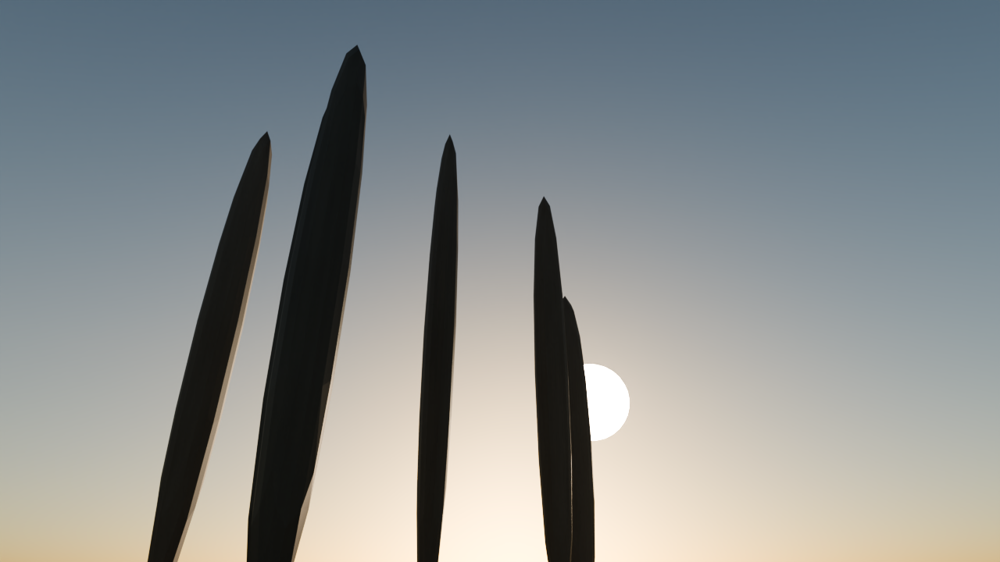
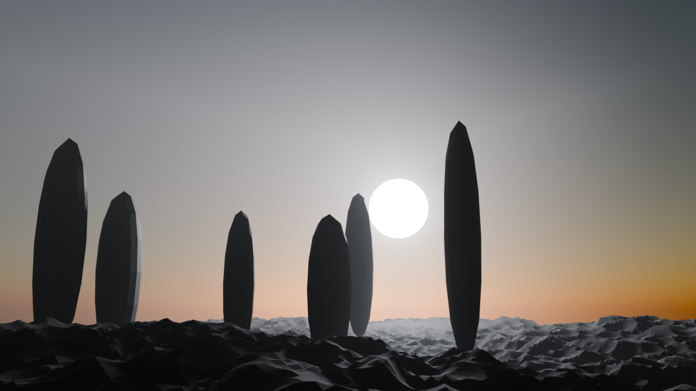
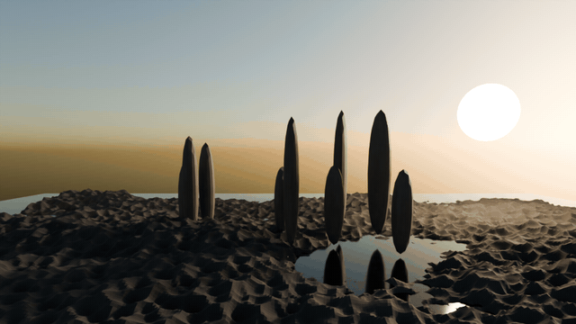

# 🎞️ JSON Cinematic — Blender

**EN:** A JSON-driven procedural cinematic scene generator for Blender. Feed it one JSON file, get a fully ray-traced cinematic render out — terrain, water, monoliths, volumetric god-rays, 160k dust particles, physical atmosphere, all built from parameters.

**TR:** Blender için JSON ile çalışan prosedürel sinematik sahne üreteci. Tek bir JSON dosyası veriyorsun; arazi, su, monolitler, hacimsel ışık huzmeleri, 160 bin toz zerresi ve fiziksel atmosferle birlikte tam yol-izlemeli (path tracing) sinematik render alıyorsun.


## ✨ What's inside / Neler var

| Component | Detail |
|---|---|
| 🏔️ Terrain | 448×448 grid (~200k verts), two-layer procedural displacement |
| 🗿 Monoliths | Seeded random placement, erosion displacement, subsurface |
| 🌊 Water | Transmission BSDF, IOR 1.333, animated-style ripple bump |
| 🌫️ Volumetrics | Noise-modulated Principled Volume → god rays, anisotropic scattering |
| ✨ Dust | 160,000 instanced emissive particles |
| ☀️ Atmosphere | Physical single-scattering sky + configurable sun lamp + visible sun disc |
| 🎥 Camera | Track-to rig, depth of field, 24 mm cinematic lens |
| 🛰️ Motion | JSON camera paths (orbit / dolly), LINEAR constant-speed keys, mesh-accurate terrain clearance, numeric report |
| 🖥️ Render | Cycles GPU (Metal), adaptive sampling, OpenImageDenoise, AgX |

## 🖼️ Gallery / Galeri

**EN:** Every world below is *just a different JSON file* — same generator, zero new code. Swap the seed, the sun, the fog color, and you get a different planet.

**TR:** Aşağıdaki her dünya *sadece farklı bir JSON dosyası* — aynı üreteç, sıfır yeni kod. Seed'i, güneşi, sis rengini değiştir; bambaşka bir gezegen çıkar.

### ❄️ Polar Dawn / Kutup Şafağı — [`examples/polar.json`](examples/polar.json)

Sun at 3.5°, icy blue fog and light. Taller, sharper spires frozen in place. — *Güneş 3.5°'te, buz mavisi sis ve ışık. Sivri, devrilmiş gibi duran kuleler.*

### 🔴 Mars Dust / Mars Tozu — [`examples/mars.json`](examples/mars.json)

High orange sun dissolved into butterscotch haze — the sun is a pale glow through the dust, just like real Mars photos. 230k dust grains, 13 scattered monoliths. — *Turuncu güneş karamel rengi tozda silik bir parıltı; 230 bin toz zerresi, 13 dağınık kule.*

### 🌙 Moonless Night / Ay Isığı Gece — [`examples/night.json`](examples/night.json)

A cold moon glowing faintly behind the spires of a black desert; only rim light survives. — *Kara çölün sivri kulelerinin ardında soluk bir ay; sadece kenar ışığı hayatta kalıyor.*

### 🔥 Inferno / Cehennem — [`examples/inferno.json`](examples/inferno.json)

A blood-red sun bleeding through ember fog; 300k embers drift over a scorched valley. — *Kan kırmızısı güneş kor sisinden kanıyor; yanmış vadide 300 bin kor süzülüyor.*

### 💚 Emerald / Zümrüt Gezegen — [`examples/emerald.json`](examples/emerald.json)

Teal sunlight and jade fog — nothing on this planet is from Earth. — *Turkuaz güneş ışığı ve yeşim sis — bu gezegenden hiçbir şey Dünya'dan değil.*

### 🗿 Colossus / Koloslar — [`examples/colossus.json`](examples/colossus.json)

Giants against a 20 mm lens from trench level — scale is the story. — *Siper hizasından 20 mm lensle devler — hikâye ölçeğin kendisi.*

### ⚪ Whiteout / Sis Sınırı — [`examples/whiteout.json`](examples/whiteout.json)

The volumetric dial turned to maximum: the mid-ground dissolves into haze and the sun becomes a pale smear. Heaviest fog this generator can carry. — *Hacimsel sis düğmesi sonuna kadar açıldı: orta plan sise çözülüyor, güneş soluk bir lekeye dönüşüyor.*

Reproduce any of them / Hangisini istersen yeniden üret:

```bash
blender --background --python generator.py -- --scene examples/polar.json
```

## 🚀 Usage / Kullanım


```bash
# default scene
blender --background --python generator.py

# your own scene
blender --background --python generator.py -- --scene my_scene.json

# fast 320p validation pass
blender --background --python generator.py -- --preview

# camera flythrough from the "animation" block (48 frames -> GIF/MP4 ready)
blender --background --python generator.py -- --anim

# 12-frame low-res animation preview
blender --background --python generator.py -- --anim-preview

# gates: schema + camera-path math + terrain clearance (no Blender needed)
python3 tests/verify.py
```

Requires **Blender 4.x / 5.x** (tested on 5.2 LTS, Apple Silicon / Metal).
No add-ons, no dependencies — just Python + Blender.

## 🎥 Motion / Hareket


*48 frames, one orbit, zero easing — hero world, r=34 / h=9.5. — 48 kare, tek tur, sıfır easing.*

**EN:** The generator doesn't just render stills. Give the scene an `"animation"` block and the camera flies a real path: `orbit` (constant angular velocity around the valley) or `dolly` (straight push-in with an optional sideways bow for parallax). There is **no easing, no fake smoothing** — every keyframe is `LINEAR`, so speed is physical. Before a single frame renders, the path is checked against the *actual displaced terrain mesh* (400k+ evaluated vertices bucketed into a height map) and pushed up wherever it would clip a ridge; the run leaves a numeric `anim_report.json` next to the frames. Dust particle lifetimes are extended to cover the whole shot — a silent killer, since default particles die at frame 10.

**TR:** Üreteç sadece kare görsel üretmiyor. Sahneye bir `"animation"` bloğu verin; kamera gerçek bir yol uçuyor: `orbit` (vadi etrafında sabit açısal hız) ya da `dolly` (düz itici giriş, parallax için isteğe bağlı yan yay). **Easing yok, sahte yumuşatma yok** — her anahtar `LINEAR`, hız fiziksel. Tek kare render edilmeden önce yol, *gerçek displacement'lı arazi mesh'iyle* (evaluated 400 bin+ tepe noktasından yükseklik haritası) karşılaştırılır; sırtı keseceği yerde yukarı itilir ve her koşu karelerin yanına sayısal bir `anim_report.json` bırakır. Toz parçacık ömrü tüm çekimi kapsayacak uzatılır — varsayılan ayar 10. karede tüm tozu öldürür, kamera animasyonunun sessiz katili.

```jsonc
"animation": {
  "frames": 48, "fps": 12,
  "resolution": [960, 540], "samples": 64,
  "type": "orbit",
  "center": [0, 0, 0], "radius": 34, "height": 9.5,
  "azimuth_start_deg": 0, "azimuth_end_deg": 360,
  "look_at": [0, 0, 5.5],
  "terrain_margin": 2.5,
  "output_dir": "renders/flythrough"
}
```

Frames land in `output_dir` as `frame_0001.png …`; pack them with:

```bash
# 47 frames: the 48th equals the 1st (full 360° loop), keep it out of the loop
ffmpeg -framerate 12 -start_number 1 -i renders/flythrough/frame_%04d.png -frames:v 47 \
  -filter_complex "[0:v]scale=640:-1:flags=lanczos,split[a][b];[a]palettegen=stats_mode=diff[p];[b][p]paletteuse=dither=bayer:bayer_scale=4" \
  renders/flythrough.gif
```

## 🎛️ Tune everything from `scene.json`

```jsonc
{
  "render":  { "samples": 1024, "resolution": [1920, 1080], "adaptive_threshold": 0.005 },
  "world":   { "sun_elevation_deg": 8.0, "sun_lamp_strength": 6.0, "background_strength": 0.25 },
  "terrain": { "subdivisions": 448, "base_height": 7.5, "seed": 7 },
  "monoliths": { "count": 9, "min_height": 9, "max_height": 17, "seed": 21 },
  "fog":     { "density": 0.0035, "anisotropy": 0.45 },
  "dust":    { "count": 160000 },
  "camera":  { "lens_mm": 24, "fstop": 2.0 }
}
```

Every rock, ray and grain of dust is a parameter. Change the seed → whole new world.

## 🧪 Why / Neden

**TR:** "Prompt → render" hattının en sade hâli: **parametreler = prompt, sahne = cevap.** Tüm geometri ve materyaller prosedürel; hiçbir doku dosyası, hiçbir harici varlık yok. Kompozisyon denemeleri için `--preview` ile saniyeler içinde düşük çözünürlükte önizleme alın, memnun kalınca aynı JSON ile tam kalitede render basın.

## 📄 License

MIT
