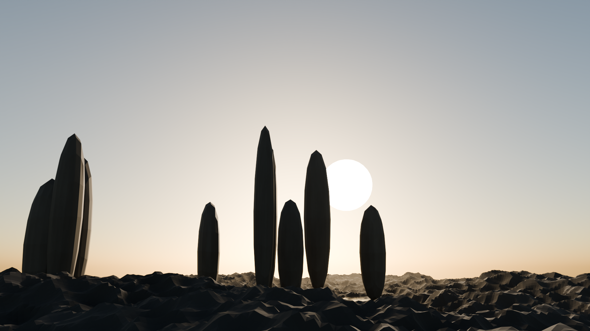

# 🎞️ JSON Cinematic — Blender

**EN:** A JSON-driven procedural cinematic scene generator for Blender. Feed it one JSON file, get a fully ray-traced cinematic render out — terrain, water, monoliths, volumetric god-rays, 160k dust particles, physical atmosphere, all built from parameters.

**TR:** Blender için JSON ile çalışan prosedürel sinematik sahne üreteci. Tek bir JSON dosyası veriyorsun; arazi, su, monolitler, hacimsel ışık huzmeleri, 160 bin toz zerresi ve fiziksel atmosferle birlikte tam yol-izlemeli (path tracing) sinematik render alıyorsun.



## ✨ What's inside / Neler var

| Component | Detail |
|---|---|
| 🏔️ Terrain | 448×448 grid (~200k verts), two-layer procedural displacement |
| 🗿 Monoliths | Seeded random placement, erosion displacement, subsurface |
| 🌊 Water | Transmission BSDF, IOR 1.333, animated-style ripple bump |
| 🌫️ Volumetrics | Noise-modulated Principled Volume → god rays, anisotropic scattering |
| ✨ Dust | 160,000 instanced emissive particles |
| ☀️ Atmosphere | Physical single-scattering sky + configurable sun lamp + visible sun disc |
| 🎥 Camera | Track-to rig, depth of field, 24 mm cinematic lens |
| 🖥️ Render | Cycles GPU (Metal), adaptive sampling, OpenImageDenoise, AgX |

## 🚀 Usage / Kullanım

```bash
# default scene
blender --background --python generator.py

# your own scene
blender --background --python generator.py -- --scene my_scene.json

# fast 320p validation pass
blender --background --python generator.py -- --preview
```

Requires **Blender 4.x / 5.x** (tested on 5.2 LTS, Apple Silicon / Metal).
No add-ons, no dependencies — just Python + Blender.

## 🎛️ Tune everything from `scene.json`

```jsonc
{
  "render":  { "samples": 1024, "resolution": [1920, 1080], "adaptive_threshold": 0.005 },
  "world":   { "sun_elevation_deg": 8.0, "sun_lamp_strength": 6.0, "background_strength": 0.25 },
  "terrain": { "subdivisions": 448, "base_height": 7.5, "seed": 7 },
  "monoliths": { "count": 9, "min_height": 9, "max_height": 17, "seed": 21 },
  "fog":     { "density": 0.0035, "anisotropy": 0.45 },
  "dust":    { "count": 160000 },
  "camera":  { "lens_mm": 24, "fstop": 2.0 }
}
```

Every rock, ray and grain of dust is a parameter. Change the seed → whole new world.

## 🧪 Why / Neden

**TR:** "Prompt → render" hattının en sade hâli: **parametreler = prompt, sahne = cevap.** Tüm geometri ve materyaller prosedürel; hiçbir doku dosyası, hiçbir harici varlık yok. Kompozisyon denemeleri için `--preview` ile saniyeler içinde düşük çözünürlükte önizleme alın, memnun kalınca aynı JSON ile tam kalitede render basın.

## 📄 License

MIT
